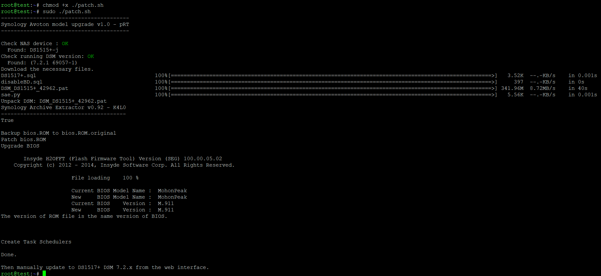
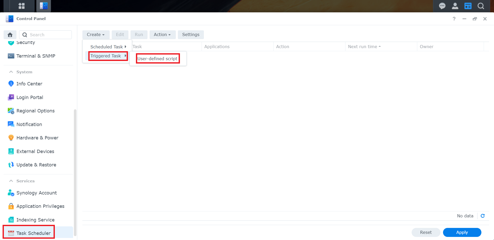
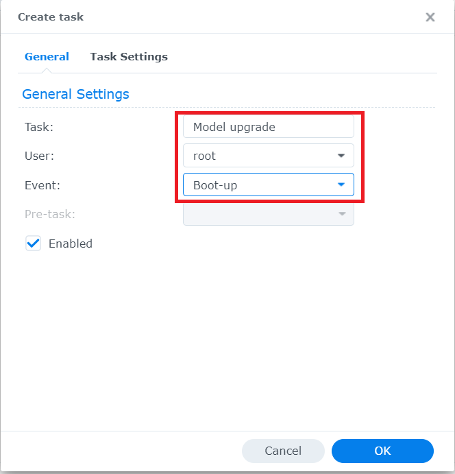
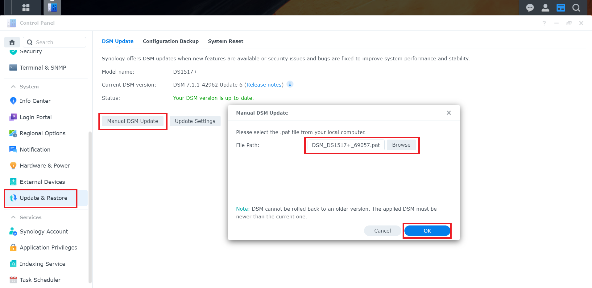

# Synology_model_upgrade - Converting ds1515+ into ds1517+ DSM 7.2.1

For the following method, it provides an automatic script:
 https://xpenology.com/forum/topic/69328-converting-ds1515-into-ds1517-dsm-72/

Usage:
 1. wget https://raw.githubusercontent.com/prt1999/Synology_model_upgrade/main/patch.sh
 2. chmod +x ./patch.sh
 3. sudo ./patch.sh

   

 4. Create a task that runs after every reboot with root privileges.
    This script will check the synoinfo.conf file on every boot and the rewrite the necessary values if necessary.
       

       

       

 5. Then manually update to DMS 7.2.1 from the web interface using the DSM_DS1517+_69057.pat file.
      

